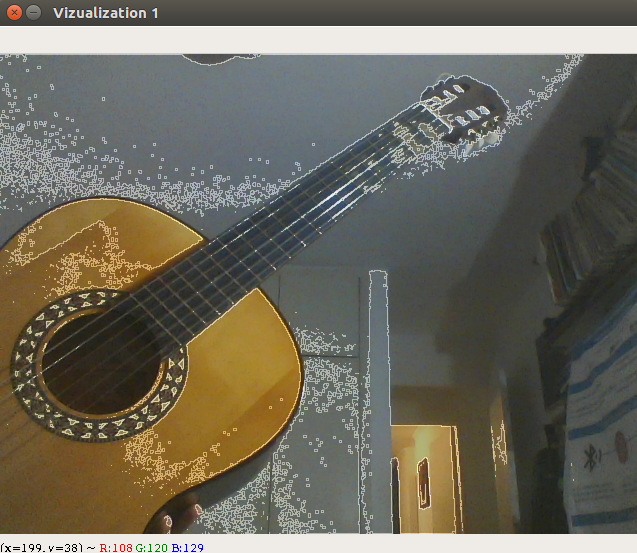
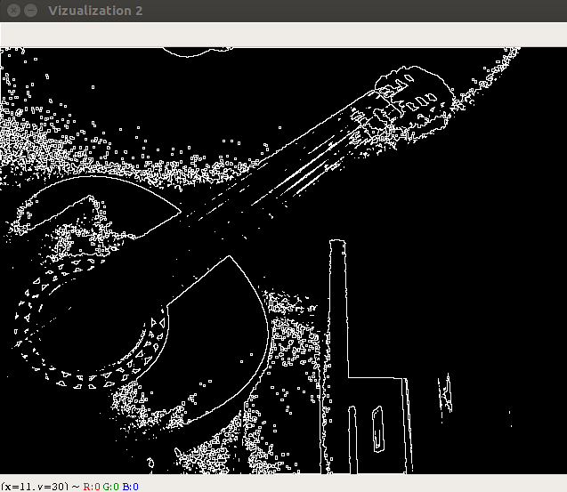

# **Dynamic Edge Detection**

Neste repositório estão presentes os códigos desenvolvidos para a **Detecção Dinâmica de Contorno** da imagem capturada pela câmera nativa do computador.

Para a execução do script, basta executar o arquivo **ContornoDin.py**.

O programa gera duas imagens a partir da captura dos frames, uma em **PB**, contendo apenas o contorno detectado, e outra **RGB**, dada pela sobreposição da captura à imagem original.

 

As seguintes bibliotecas são dependências necessárias para o funcionamento do Script:

1. openCV;

2. numpy;

3. scipy;
